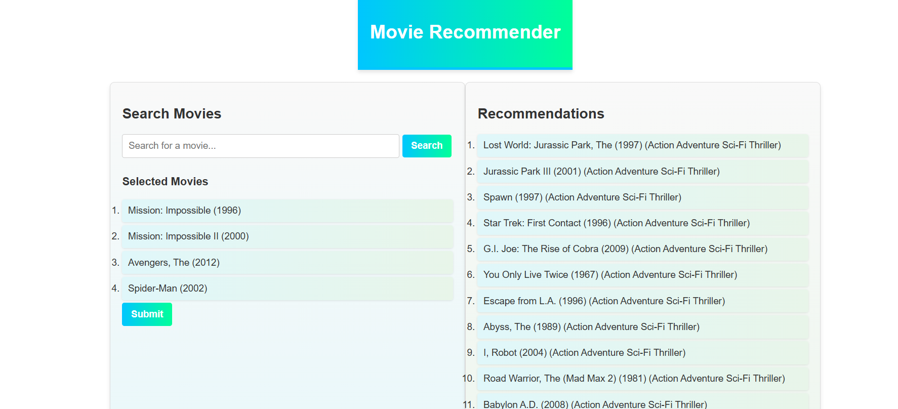

<h2>Movie Recommender System</h2>
A machine learning approach that is based on cosine similarity on movie lens dataset that recommends movies to user based on what movies he has liked previously. The illustration is given as:
 

<h3>User can select and add their favorite movies and once submitted the algorithm generates list of movies he might like</h3>

